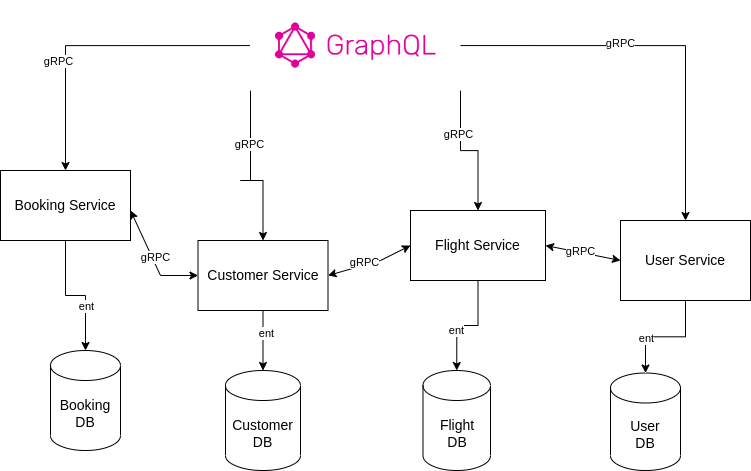

## Booking Flight Microservices

- Project use microservices architecture with gRPC and GraphQL, each service is independent and connect to each other by
  gRPC. Also, each service working with separate database. 



- For database design, refer to [dbdiagram](./docs/db.png)

- For API Reference, refer to [graphql_example](./docs/graphql_sample.md)

### Run Project with Docker-Compose

- Simple Run `docker compose up -d` or `docker compose up` if you want to see log

- GraphQL Server will run via: http://localhost:3000

- Clean up everything created by docker-compose by use your terminal

```bash
  docker-compose down
  docker volume prune -y
```

### Frameworks and Libraries

- [GQL-Gen](https://github.com/99designs/gqlgen) for GraphQL

- [Ent-Go](https://entgo.io/) for ORM

- [Gin](https://github.com/gin-gonic/gin) for Serve Sever

- [Viper](https://github.com/spf13/viper) for reading config

- [Proto Complier](https://grpc.io/docs/protoc-installation/) for proto init and gRPC generate code

### Project Structure

- `cmd`: It contains graphQL server to run a GraphQL Playground, also with [Gin](https://github.com/gin-gonic/gin)

- `docs`: It contains all documentation for example API Reference

- `graphql`: It contains all code generated by `gqlgen` for GraphQL Server, also resolver, `schema` and model-generated
  by [gql](https://github.com/99designs/gqlgen)

- `grpc`: It contains all gRPC services,
  includes `user-service`, `flight-service`, `customer-service`, `booking-service`

- `helper`: It contains all helper functions. For example `check_input` or `config`,... etc helper

- `middleware`: It contains all middleware for the GraphQL server, serve with Gin middleware

- `pb`: It contains all proto files generated by `proto-complier` for gRPC services

- `proto`: It contains all proto-define for gRPC services

- `scripts`: It contains all scripts for `docker-compose`

#### Project Structure for gRPC Service

- `ent`: It contains all ent-generated code by [ent-go-framework](https://entgo.io/), also with `ent/schema` for
  database design

- `handler`: It contains handler for gRPC service

- `intercepter`: It contains all intercepter for gRPC service

- `internal`: It contains all internal package using for gRPC service, example: `auth` or `config`

- `repo`: It contains repository for gRPC service, include init database connection and CRUD function

- `request`: It contains request, response for gRPC service, but in this project, only for `pagination`

- `config.yml`: Config file for gRPC port, db connection config, ... etc

- service.Dockerfile: Dockerfile for gRPC service

### Code

- [x] GraphQL Server
- [x] Database Connection
- [x] Pagination GraphQL
- [x] Authentication
- [ ] Unit test (0%)

### gRPC Service

- [x] User Service
    - [x] Query User (Admin)
    - [x] Create User (Admin)
    - [x] Register Customer
    - [x] Login
- [x] Flight Service
    - [x] Create Flight (Admin)
    - [x] Update Flight (Admin)
    - [x] Query Flight
- [x] Customer Service
    - [x] Change Password
    - [x] Query Customer (Admin)
    - [x] Update Customer
- [x] Booking Service
    - [x] Create Booking
    - [x] Cancel Booking
    - [x] Booking History
    - [x] View Booking
    - [x] Query Booking (Admin)

### Document

- [x] Database design
- [x] API Reference

### Delivery

- [x] Dockerized
- [x] Docker-compose
- [x] Multi-stage build